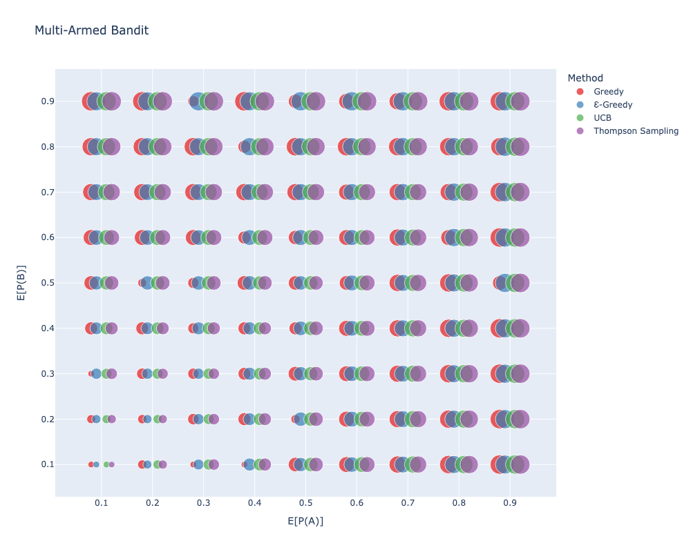

# HW2 - Multi-armed bandit

## Problem Description

1. 결과가 0 혹은 1이고 E(P(X))를 조절할 수 있는 arm을 2개 (A, B) 만드세요. 10%로 설정하면 10%의 확률로 1이 나와야 하는 arm입니다.
2. greedy, e-greedy, UCB, thompson sampling을 구현하세요. 하이퍼파라미터는 적당하게 설정하고 바꾸지 않습니다.
3. A의 승률이 10%, 20%, …, 90%, B의 승률이 10%, 20%, …, 90%이고 위 arm에 대해서 5번씩 테스트하여 각 알고리즘별 평균 승수를 구하세요. 총 9 X 9 X 5 X 4번 테스트해야 하고 최종 결과는 9 X 9 X 4 만큼 나와야 합니다.
4. 위 결과를 scatter plot으로 표현하세요. x축은 E(P(A))가 10%, 20%, …, 90% 이고 y축은 E(P(B))가 10%, 20%, …, 90%를 의미합니다. color는 알고리즘, size는 알고리즘별 평균 승수입니다.
5. 코드는 각자의 깃헙에, 최종 이미지 1장은 이 채널에 제출합니다.

made by [@adldotori](https://github.com/adldotori)

## How to Solve

1. Run `main.py`: You can get `result.csv`.
2. Run `plot.py`: You can get `result.png`.

