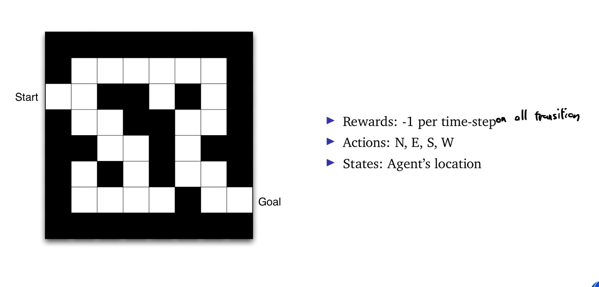
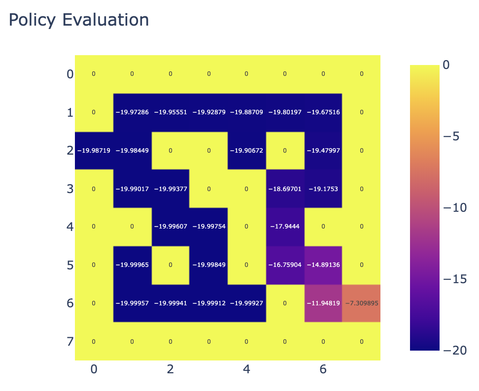
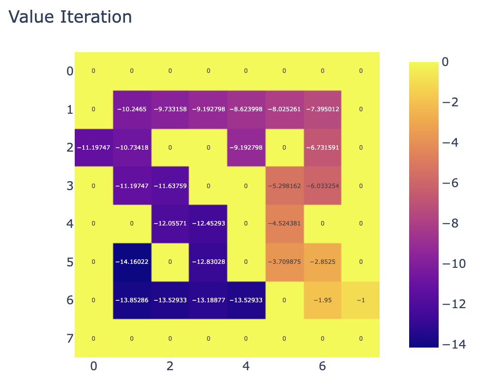

# HW3 - Policy evaluation and value iteration

## Problem Description

사진과 같은 environment에서 policy evaluation과 value iteration을 사용해서 수렴할때의 value map을 return하는 함수를 작성하세요!

## How to Solve

1. Run `main.ipynb`: You can get everything.

### Results

| Policy evaluation | Value iteration |
| --- | --- |
|  |  |