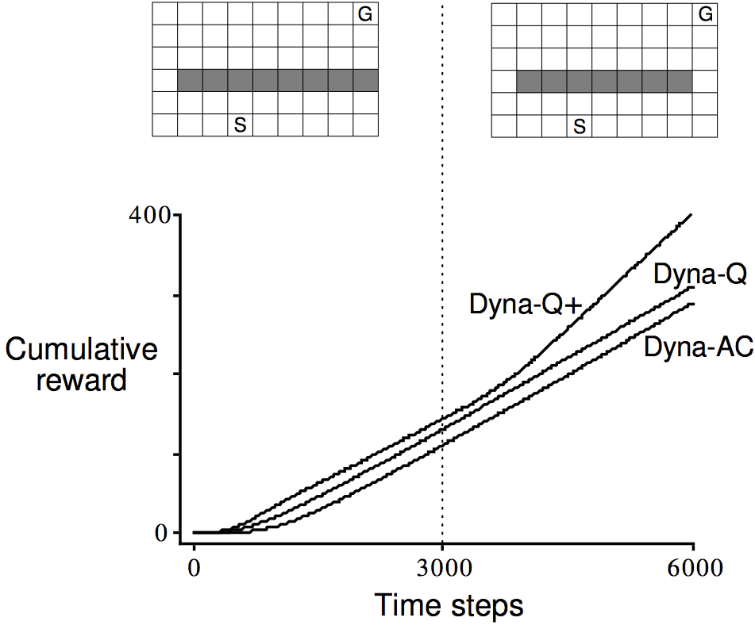
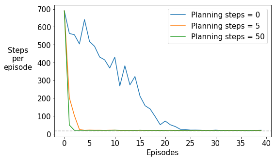
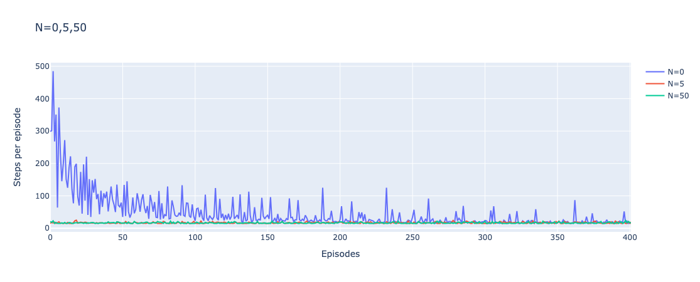

# HW6 - Dyna-Q

## Problem Description

필수:
왼쪽 미로에서 dyna q learning 을 이용해서 goal에 도착하는데 필요한 step수 그래프를 그리기.
x축 episode y축 step.
planning step을 0(naive q learning),5,50으로 오른쪽과 같은 그래프를 그리세요.
optional:
왼쪽 maze에서 3000step 학습 후 env를 오른쪽으로 바꾸는 경우 Accumulated reward 그래프를 그려보세요

|  |  |

## Results

